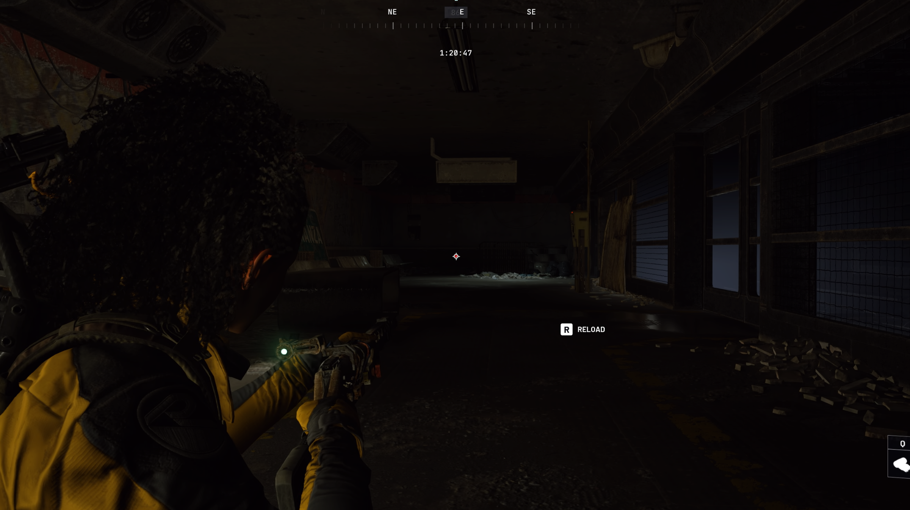
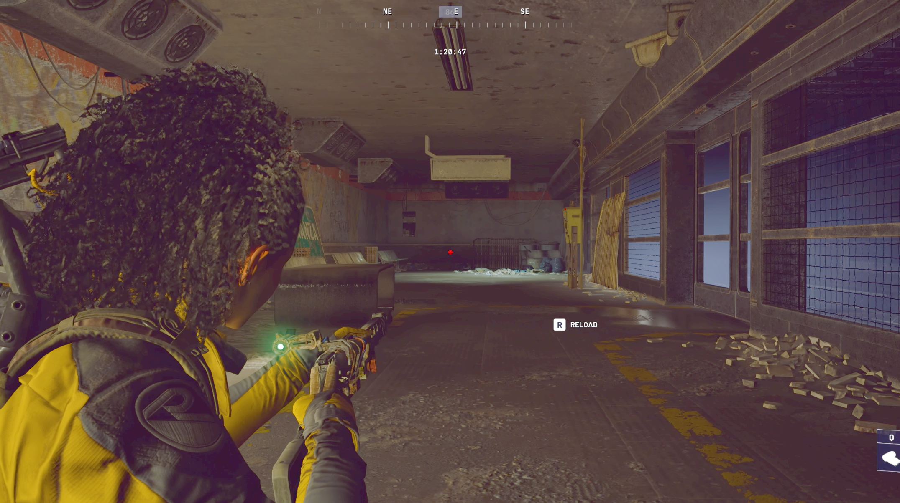

# BetterVibrance

**BetterVibrance** is a lightweight Windows system tray app that lets you instantly switch between display color profiles with a single keypress — or automatically when your games launch.

Configure Digital Vibrance, Gamma, and Contrast per profile, choose which monitors to control, and let BetterVibrance handle the rest.

---

## Screenshots

### Example 1

| Before | After |
|:------:|:------:|
|  |  |

### Example 2

| Before | After |
|:------:|:------:|
|  |  |

---

## Demo

---

## Who Is It For?

- **Gamers** who want boosted vibrance in-game but accurate colors for everything else
- **Streamers and content creators** who switch between a calibrated editing profile and a high-vibrance viewing profile
- **Multi-monitor users** who want fine-grained control over which displays get color-adjusted

---

## Features

- **Digital Vibrance, Gamma & Contrast** — per-profile sliders with live preview as you drag
- **Unlimited profiles** — create, duplicate, reorder, import & export (`.bvprofile` files)
- **Global hotkeys** — assign key combos to profiles or cycle through them in sequence
- **Game-aware auto-switching** — link processes to profiles so they activate on launch and restore on exit
- **Monitor selection** — choose exactly which displays to control
- **5 UI themes** — switch at runtime, no restart required
- **System tray operation** — toast notifications, tray menu profile switching, minimize to tray
- **Start with Windows** and **auto-updates** built in
- **24-hour free trial** — try every feature before you buy

---

## Requirements

- Windows 10 / 11 (64-bit)
- NVIDIA GPU with drivers installed (AMD: experimental — may work but untested)

---

## Getting Started

1. Download the latest installer from the [Releases](../../releases) page
2. Run the installer and launch BetterVibrance
3. Start your 24-hour free trial or enter a license key
4. Open Settings to configure your monitors and profiles
5. Assign hotkeys and start switching

---

## Pricing

One-time purchase, no subscription.

Available at: [Lemon Squeezy store](#) *(link coming soon)*

---

## Legal

See [LEGAL.md](LEGAL.md) for privacy policy and contact information.
