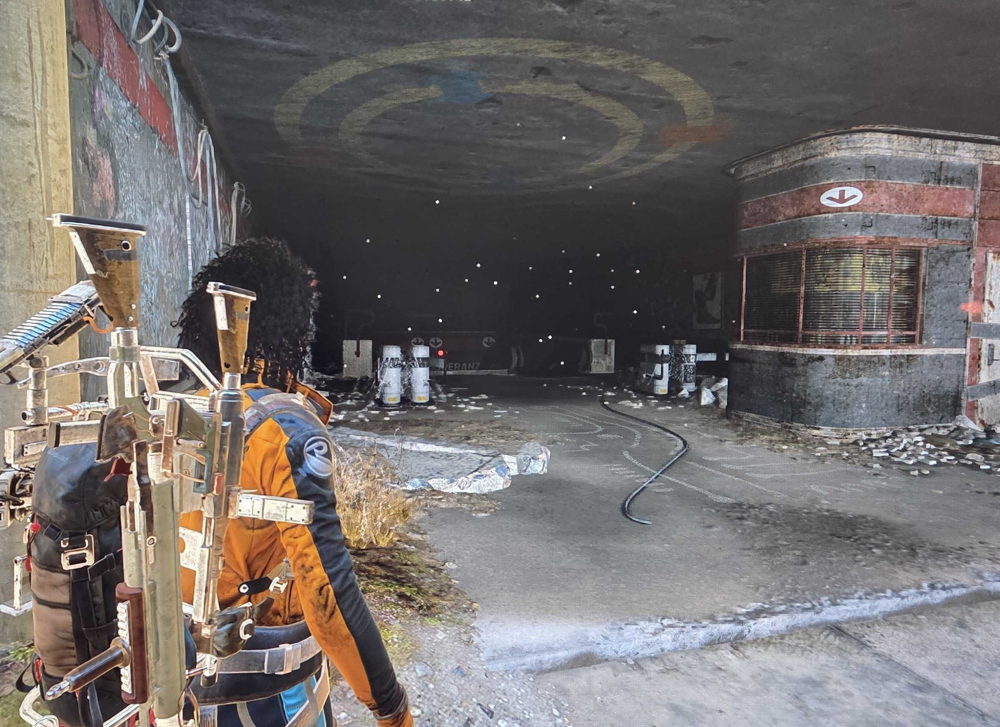
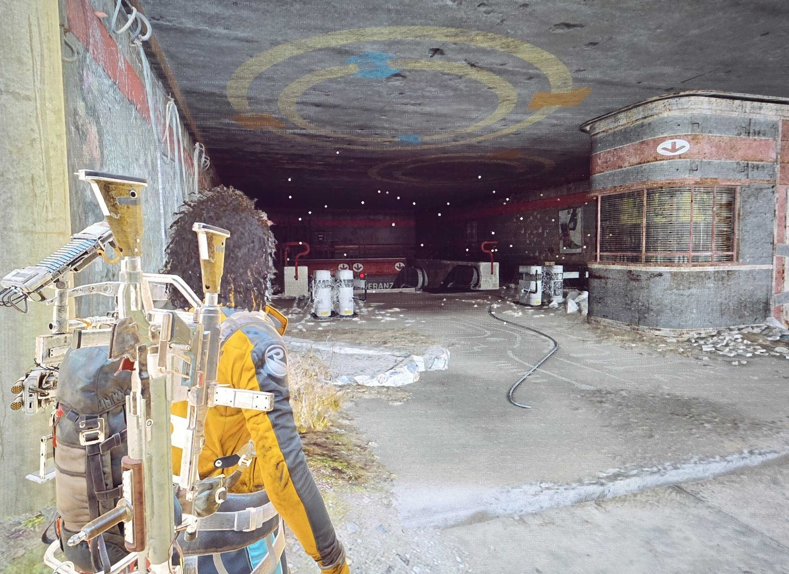
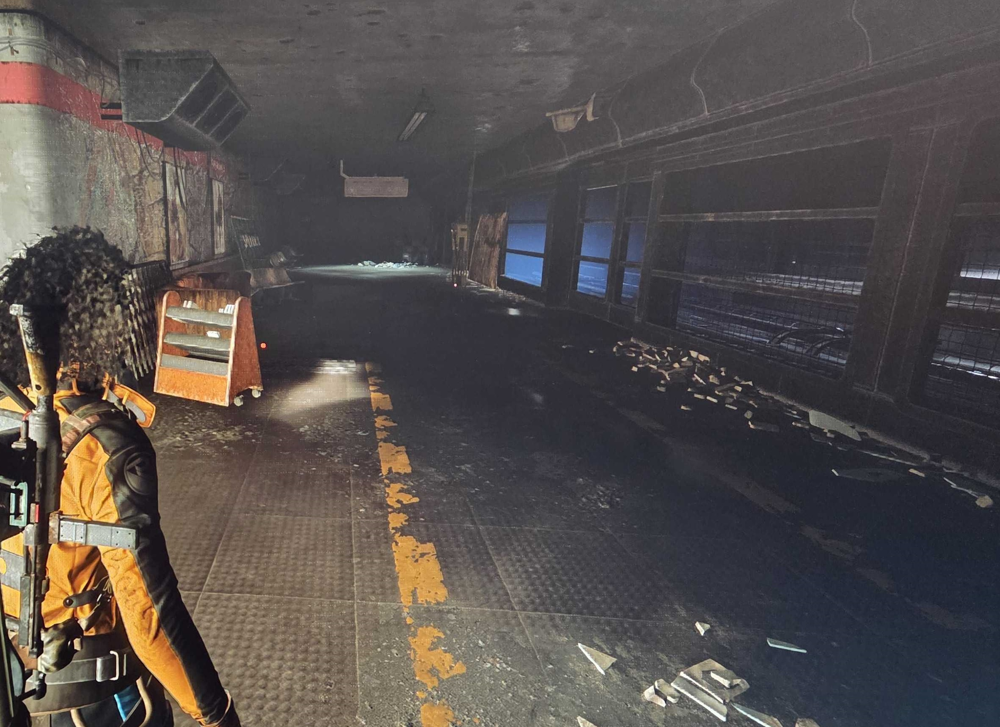
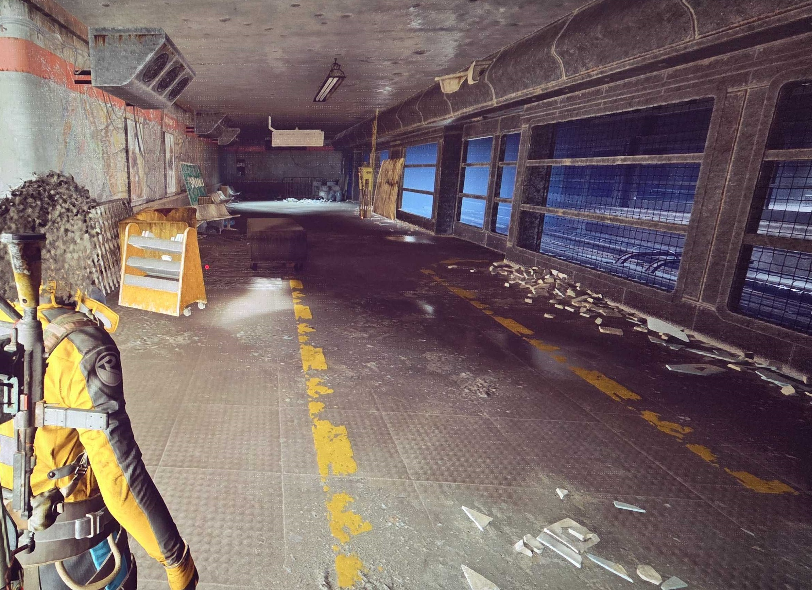

# BetterVibrance

**BetterVibrance** is a lightweight Windows system tray app that lets you instantly switch between display color profiles with a single keypress — or automatically when your games launch.

Configure Digital Vibrance, Gamma, and Contrast per profile, choose which monitors to control, and let BetterVibrance handle the rest.

---

## Screenshots

### Example 1

| Before | After |
|:------:|:------:|
|  |  |

### Example 2

| Before | After |
|:------:|:------:|
|  |  |

---

## Demo

---

## Who Is It For?

- **Gamers** who want boosted vibrance in-game but accurate colors for everything else
- **Streamers and content creators** who switch between a calibrated editing profile and a high-vibrance viewing profile
- **Multi-monitor users** who want fine-grained control over which displays get color-adjusted

---

## Features

### Display Control
- **Digital Vibrance, Gamma & Contrast** — per-profile sliders with instant application
- **NVIDIA support** — full support via NVAPI. AMD is detected automatically but considered experimental
- **Monitor selection** — choose exactly which displays BetterVibrance controls
- **Live preview** — settings apply in real-time as you drag sliders; reverts automatically after 1.5s of inactivity

### Profiles
- **Unlimited profiles** — create as many as you need, each with independent display settings
- **Drag-and-drop reordering** — rearrange profile tabs by dragging, or right-click to Move Left/Right
- **Duplicate profiles** — right-click a tab to instantly copy all settings
- **Slider reset buttons** — snap any slider back to its neutral default with one click
- **Import & Export** — share profiles as `.bvprofile` / `.bvprofiles` files (includes display settings, hotkeys, and linked processes)

### Hotkeys
- **Global hotkeys** — assign a key combo (with Alt, Ctrl, Shift modifiers) to each profile for instant switching
- **Cycle hotkey** — step through multiple profiles in sequence with a single key
- **Custom cycle order** — define which profiles to include and in what order
- **Conflict detection** — visual warning when two profiles share the same hotkey
- **Process-gated hotkeys** — optionally restrict a hotkey to only work while a linked process is running

### Game-Aware Auto-Switching
- **Link processes to profiles** — pick from currently running apps or add executables manually
- **Auto-switch** — profiles activate automatically when a linked game or app launches
- **Auto-restore** — reverts to your chosen base profile when the linked process exits
- **Conflict warnings** — alerts when multiple profiles claim the same process

### UI Themes
Switch between 5 built-in themes at runtime — no restart required:
- **Classic Dark** — clean blue accent on neutral near-black (default)
- **Cyber Neon** — hot pink/magenta cyberpunk aesthetic
- **Phantom Green** — Razer-inspired electric green
- **Sunset Blaze** — warm neon orange/amber
- **Midnight Blue** — Windows-style dark theme with subtle blue tones

### System Integration
- **System tray** — runs silently in the background with zero clutter
- **Tray menu** — shows active profile with bullet indicator; switch profiles from the menu
- **Toast notifications** — on-screen overlay shows the profile name and settings on every switch
- **Start with Windows** — always ready when you are
- **Minimize to tray** — closing the Settings window hides it; re-opening is instant and preserves your state
- **Auto-updates** — checks for new versions in the background and notifies you when one is available

---

## Requirements

- Windows 10 / 11 (64-bit)
- NVIDIA GPU with drivers installed (AMD: experimental — may work but untested)

---

## Getting Started

1. Download the latest installer from the [Releases](../../releases) page
2. Run the installer and launch BetterVibrance
3. Enter your license key when prompted
4. Open Settings to configure your monitors and profiles
5. Assign hotkeys and start switching

---

## Pricing

One-time purchase, no subscription.

Available at: [Lemon Squeezy store](#) *(link coming soon)*

---

## Legal

See [LEGAL.md](LEGAL.md) for privacy policy and contact information.
