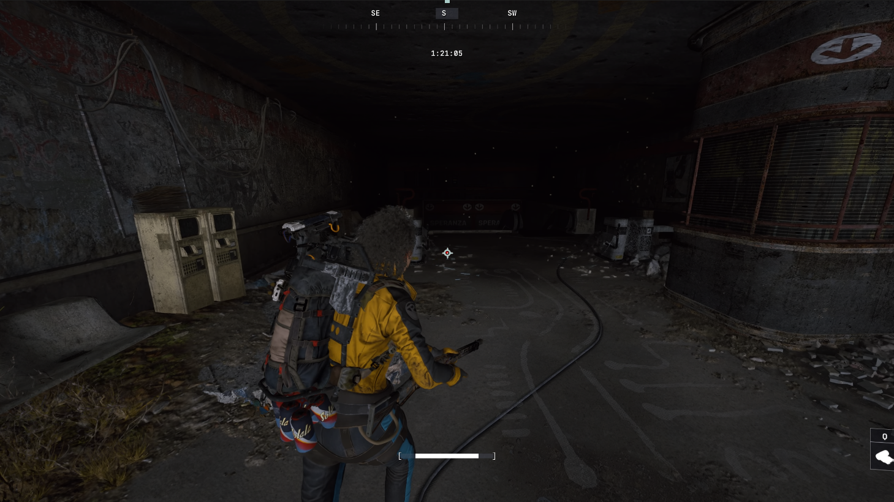
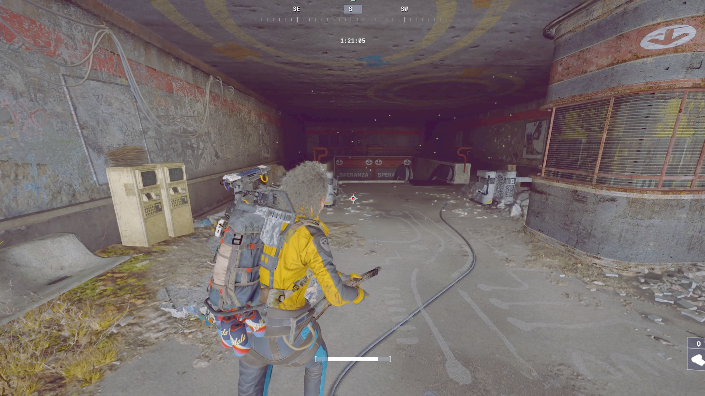

# BetterVibrance

    

**BetterVibrance** is a lightweight Windows system tray app that lets you instantly switch between display color profiles with a single keypress — or automatically when your games launch.

Configure Digital Vibrance, Gamma, and Contrast per profile, choose which monitors to control, and let BetterVibrance handle the rest.

> **Safe & transparent:** BetterVibrance uses standard Windows display APIs — the same ones used by the NVIDIA Control Panel and AMD Radeon Software. It does not modify, inject into, or read any game files or processes. It is fully compatible with all anti-cheat systems including EAC, Vanguard, BattlEye, and FACEIT. [Read more &rarr;](LEGAL.md#safety--transparency)

---

## Screenshots

### Example 1

| Before | After |
|:------:|:------:|
|  |  |

### Example 2

| Before | After |
|:------:|:------:|
|  |  |

---

## Demo

---

## Who Is It For?

- **Gamers** who want boosted vibrance in-game but accurate colors for everything else
- **Streamers and content creators** who switch between a calibrated editing profile and a high-vibrance viewing profile
- **Multi-monitor users** who want fine-grained control over which displays get color-adjusted

---

## Features

- **Digital Vibrance, Gamma & Contrast** — per-profile sliders with live preview as you drag
- **Unlimited profiles** — create, duplicate, reorder, import & export (`.bvprofile` files)
- **Global hotkeys** — assign key combos to profiles or cycle through them in sequence
- **Game-aware auto-switching** — link processes to profiles so they activate on launch and restore on exit
- **Audio Mute hotkey** — mute specific apps (like games) with one keypress while keeping Discord, music, and everything else audible
- **Blue Light Filter** — per-profile warmth slider that reduces blue light for late-night sessions
- **Do Not Disturb** — automatically disables Windows notifications when your gaming profile is active
- **HDR Quick Toggle** — enable or disable Windows HDR per profile, no more digging through Settings
- **Monitor selection** — choose exactly which displays to control
- **5 UI themes** — switch at runtime, no restart required
- **System tray operation** — toast notifications, tray menu profile switching, minimize to tray
- **Start with Windows** and **auto-updates** built in
- **24-hour free trial** — try every feature before you buy

---

## Requirements

- Windows 10 / 11 (64-bit)
- NVIDIA GPU with drivers installed (AMD: experimental — may work but untested)

---

## Getting Started

1. Download the latest installer from the [Releases](../../releases) page
2. Run the installer and launch BetterVibrance
3. Start your 24-hour free trial or enter a license key
4. Open Settings to configure your monitors and profiles
5. Assign hotkeys and start switching

---

## Pricing

**Try it free for 24 hours** — full access to every feature, no credit card required.

Love it? Grab a **one-time license** — pay once, use forever. No subscription, no recurring fees.

🛒 **[Buy now](https://buy.polar.sh/polar_cl_FvbiADfLx0OjJiMEqTGEGzTqBPy83WNc93aP62QkSoQ)** — payments handled securely by [Polar](https://polar.sh).

> After purchase, your license key will be instantly delivered to your email by Polar.

---

## Legal

See [LEGAL.md](LEGAL.md) for privacy policy, license agreement, and contact information.
